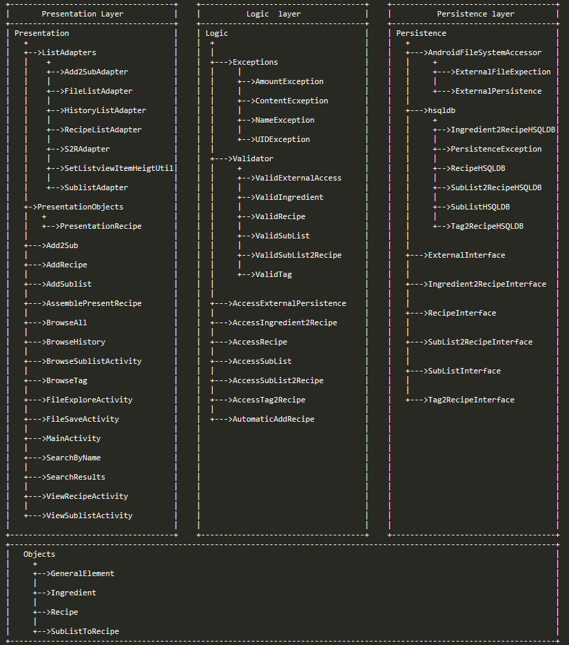

# Application Architecture

# Package Structure

# Package Description

## Presentation
This Layer contains Activity classes that are responsible for displaying information and accepts input from users. Classes within ListAdapters allows users to converts data from database to which users could visually see, such as list of recipes, list of histories, list of sublists. Classes within PresentationObjects package allows users to visually see the recipes, which includes the ingredient(s), tag(s), and the other information of the recipe(s).

## Logic
"AccessExternalPersistence" uses the method in ExternalPersistence class which enables users to share recipes and it could also be used to transfer collections between different deivces. "AccessIngredient2Recipe" handles the relation between ingredients of a recipe and a recipe. "AccessTag2Recipe" handles the connection between tags of a recipe and the corresponding recipe. "AccessRecipe" class handles operation for retrieving, adding and deleting recipes and histories from persistence layer stub database via "Application" layer. Results of operation then sent back to presentation layer for user to view. "AccessSublist" is responsible to access sublists while "AccessSubList2Recipe" is responsible for handing connections between sublists and the recipes belong to them.

## Objects
There are four objects, Ingredient which is used for recipe, Recipe which stores the other information other than tag or ingredient, SubListToRecipe could be considered as the relation between single recipe and single sublist, which stores two integers used for database purpose, thus it could be considered as an Object. 

While GeneralElement is used by representing the relation between recipe & sublist, recipe & tag, and the relationship between recipe and ingredient, as it satisfies the condition that the relation is conposed of unit which contains an interger and a string 
Those objects would be used within each layer, which is why those objects are in domain model.

## Persistence
"Stub" is now removed from this layer, only "hsqldb" is now left here, handling the database responsiblity. Ingredient2RecipeHSQLDB inplements "Ingred2RecipeInterface", RecipeHSQLDB implements "RecipeInterface", Tag2RecipeHSQLDB implements "Tag2RecipeInterface" etc. They contain the data stored on the device. The history of a recipe from last iteration is now incorperated into recipe object.

## Application
"Service" class provides logic layer methods to access to the presentation layer and the persistence layer.

# Application's Current State
We chose the branching strategy as github flow.

Currently, users are able to browse all recipes, accessed histories of recipes. Besides, user could also delete recipes and delete histories from the stub database & SQL database. If a recipe is deleted from the device, user would be taken back to the main menu, it holds for history manipulation as well. What's more, users are now able to add recipes to sublists which might be "My favourite", "Power" etc. User could also delete recipes recipes from sublists. Newly added share function for recipe enabled the application with the potentiality to share recipes between users in multiple ways, it could also be used by users for trander data purpose.

For this iteration, hyper sql database is responsible for handing database, stub is removed to test folder for test purpose. Mock is used for test, which tests the communication between logic and persistence layer.

For furthur implementation, users would be idealy to have the function which uses QR code to transfer recipes. The function which allows user to personalize their recipes would also be added to this application. Furthur more, function allows user to change recipes names inside a recipes, adding comments, changing ingredients, changing directions for recipes after recipes has been added to their collection.
