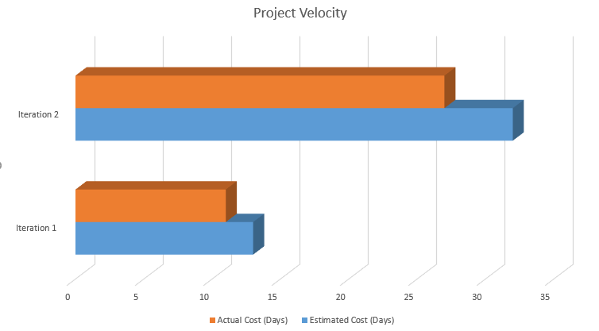

By taking a look at our project, for both iteration one and iteration two, the actual time we spent on the project was less than the time we expected. For iteration one, it was because we did not have an idea about how the teamwork would turn out and what is everyone's ability at developing application, so we underestimated ourselves. For iteration two, we thought it would take us a long time to implement SQL database as that would've been the first time for our teammates to implement SQL database. But it turned out back-end implementation was not that complicated or time consuming, but front-end implementation took longer time instead, combining the time we spent on front-end and back-end developing, it matched up with the expectation. If we have the chance to start over, more people would spend their time on front-end implementation.

At the end of each iteration, we had code reviews, during code review meetings, we would look into our project, and try to find out if there were any design violated SOLID principles or any code smells. Upon learning design patterns, we applied one or more design patterns in our project, which has been proven the ablity of facilitating the development of high cohesion and low coupling. The result of having code reviews and applying design patterns we learned is we have few code smells each iteration and the program are easy to extend for the next iteration.

What we did really well was the cooperation between team members, different from many groups, who would spent time chatting through slack. We have regular meetings, twice a week, which benefitted us by making the communication between team members much easier, and also, regular meetings gave us chances to share our experiences at developing different part of the program, which is part of the reason why we could catch up with the progress and meet our expectations.

In order to let each team member get exposure to our project, we made the decision that every one of us should be responsible for both front-end and back-end development. And also, we encourage regular pushing our work to the branch, which allows us to get instant help from other teammates, and everyone benefit from the bug fixing process. Although the process of learning new knowledges took some time, making sure every one is on board and be able to diagnose problems in the code made it possible for us to move forward even faster in the next iteration.

Apart from regular and effective commnication, our meeting for teammates explaining their ideas about implementing each part of the in details has also benefited us. In the transition from iteration one to iteration two, we learned the importance of making project structure clear before an iteration start which has saved us a lot of time on our project, we have adapted a good version control branching strategy which is github flow. But, what we would try in our future project is we might try to put someone on a single part of the project, as learning from experience is always faster than learning from tutorials online.

